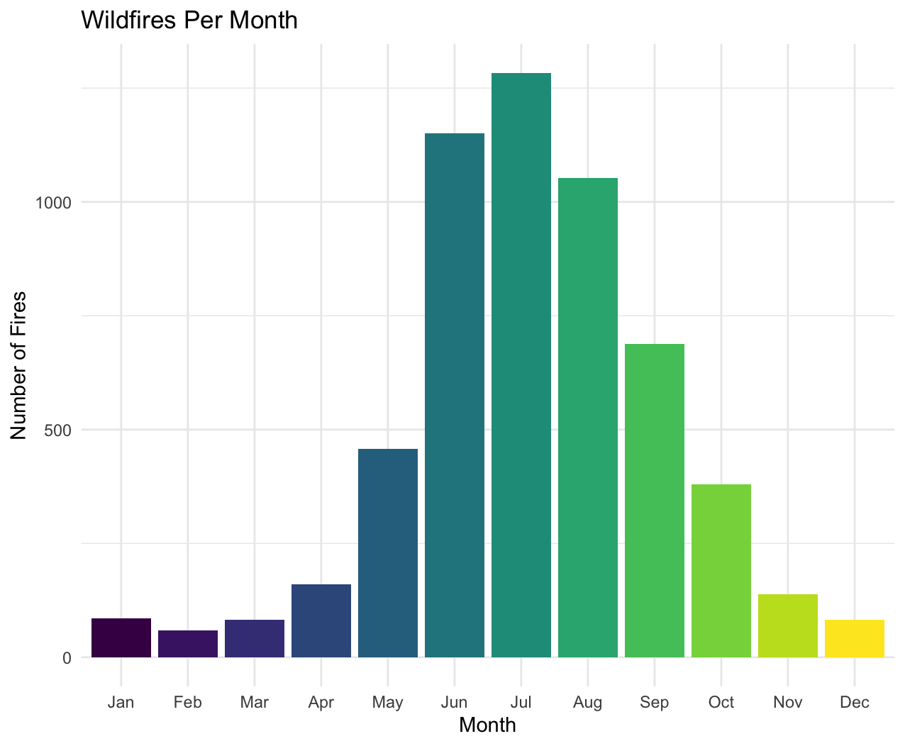
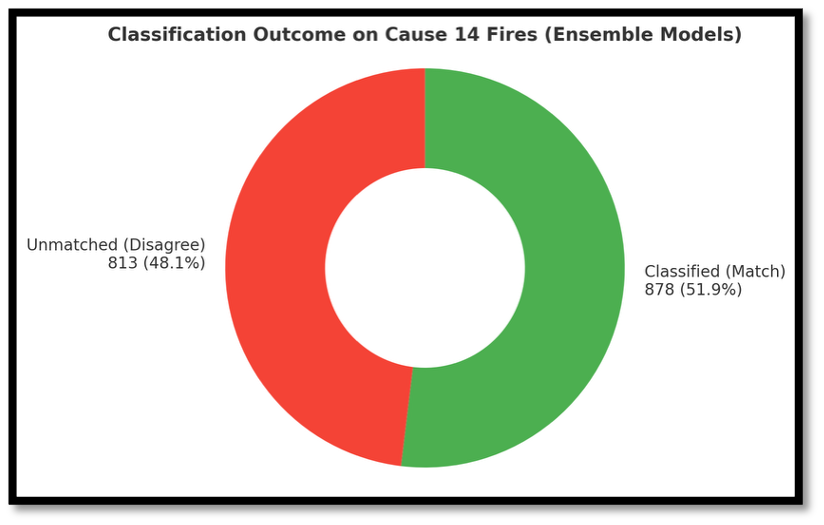
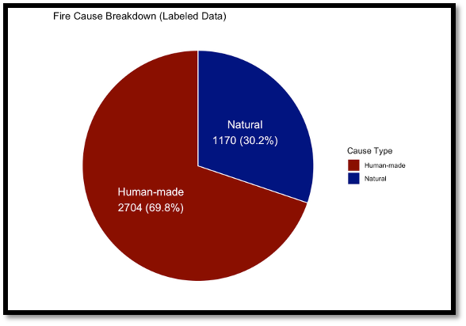
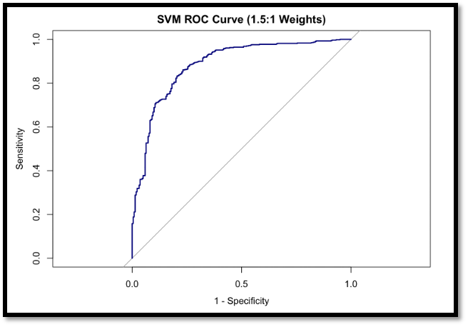
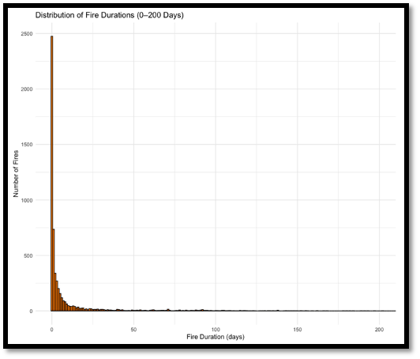
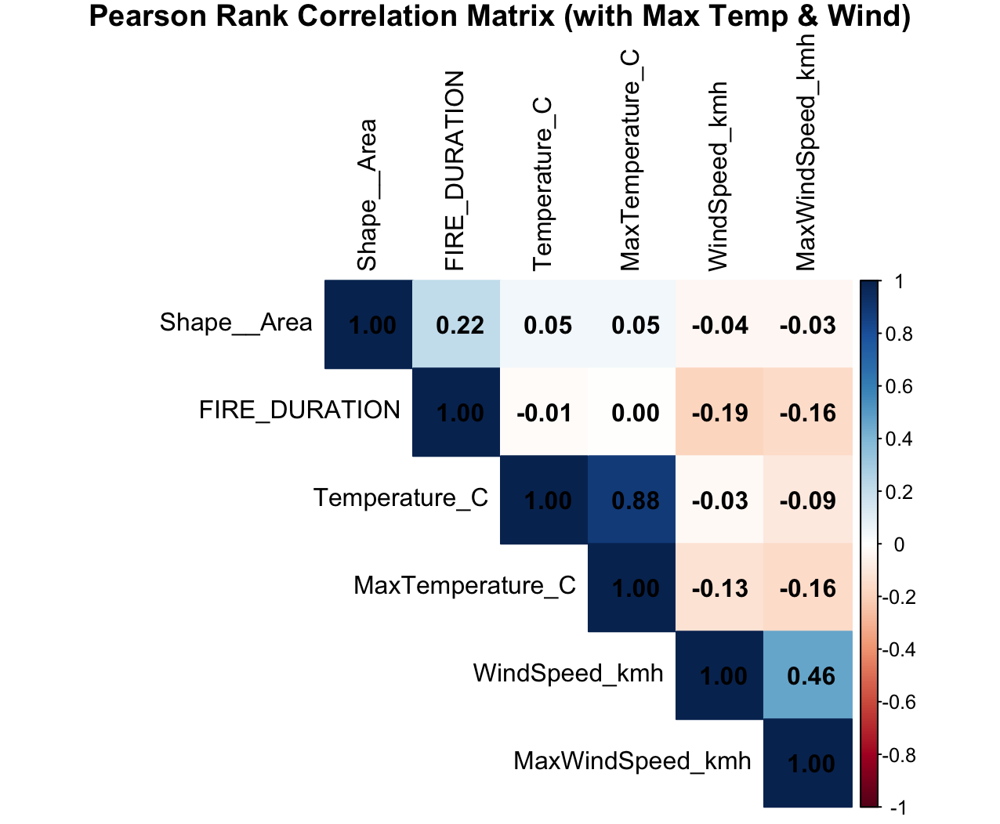

# Wildfire Analysis & Prediction for California

> **Course:** IS-517: Methods of Data Science
> **Team:** Apurva Malpure · Prithvish Taukari · Sai Kiran Billa · Yashvi Bhatt

---

## Overview

Wildfires in California are a growing threat to life, property, and the environment.
This project applies machine learning to two primary California wildfire datasets to:

1. **Predict** daily wildfire ignition risk from weather and seasonal signals.
2. **Classify** unknown fire causes (≈31 % of records) as human-made or natural.
3. **Predict** fire duration using weather and temporal features.
4. **Identify** geographic wildfire hotspots and risk zones across the state.

---

## Motivation

More than 31 % of CALFIRE incident records carry unknown or undocumented causes.
Environmental factors such as temperature, wind speed, precipitation, and season
interact non-linearly, making rule-based approaches inadequate.
By combining supervised classification, regression, and spatial clustering we aim to
turn raw incident logs into actionable risk intelligence.

---

## Required Datasets

Three datasets are required to reproduce this project.
They are **not tracked in this repository** due to file size.
Place each file in the `data/` folder before running any script.

| File | Required by | Where to obtain |
|---|---|---|
| `fires_with_max_weather_corrected.csv` | All RQ2 scripts, RQ3, RQ4, Rmd | Provided by course / team-engineered from CALFIRE + weather APIs |
| `CA_Weather_Fire_Dataset_1984-2025.csv` | `research-question-4.R`, Rmd (RQ1) | [Zenodo](https://zenodo.org) — daily CA weather × fire dataset |
| `CA_Weather_Fire_Dataset_2008_2023_with_duration.csv` | Rmd (RQ3 SVM duration analysis) | Team-engineered from CALFIRE perimeters |

**Engineering steps already applied to `fires_with_max_weather_corrected.csv`:**
- `FIRE_DURATION` calculated from alarm and containment dates.
- `Latitude` / `Longitude` extracted from polygon centroids.
- Temperature and wind data integrated via external APIs.

---

## Pre-generated Outputs (Committed to Repository)

The following files are the outputs of slow training runs and are committed so the
report can be re-knitted without re-running the full training pipeline.

| File | Generated by | Purpose |
|---|---|---|
| `models/5_fold_rf.rds` | `Method1_Final_model.R` | RQ2 Method 1 — trained Random Forest |
| `models/xgb_model.rds` | `Method1_Final_model.R` | RQ2 Method 1 — trained XGBoost |
| `models/svm_model_weight1.5.rds` | `Method2_Complete.R` | RQ2 Method 2 — trained SVM (RBF, weight 1.5) |
| `data/cause14_dual_model_predictions_5fold.csv` | `Method1_Final_model.R` | RQ2 Method 1 — per-record raw predictions |
| `data/cause14_final_ensemble_classification.csv` | `Method1_Final_model.R` | RQ2 Method 1 — final ensemble classifications |
| `data/cause14_binary_predictions_with_confidence.csv` | `Method2_Complete.R` | RQ2 Method 2 — binary predictions with probabilities |

---

## Repository Structure

```
project-root/
│
├── data/                                          # Input datasets + intermediate outputs
│   ├── fires_with_max_weather_corrected.csv       # ⚠ not tracked — add manually
│   ├── CA_Weather_Fire_Dataset_1984-2025.csv      # ⚠ not tracked — add manually
│   ├── CA_Weather_Fire_Dataset_2008_2023_with_duration.csv  # ⚠ not tracked — add manually
│   ├── cause14_dual_model_predictions_5fold.csv   # pre-generated, committed
│   ├── cause14_final_ensemble_classification.csv  # pre-generated, committed
│   └── cause14_binary_predictions_with_confidence.csv       # pre-generated, committed
│
├── src/                                           # All analysis scripts
│   ├── Seasonal_trends.R                          # Monthly / seasonal trend plots
│   ├── NaturalvsHumanMade_Piechart.R              # RQ2 cause-type pie chart
│   ├── Pie_Chart_Classification_by_class.R        # RQ2 cause distribution donut
│   ├── Method1_Final_model.R                      # RQ2 Method 1 — RF + XGBoost ensemble
│   ├── Method1_Pie_Chart.R                        # RQ2 Method 1 — classification outcome pie
│   ├── Method2_Complete.R                         # RQ2 Method 2 — binary SVM
│   ├── Method-2_Plots.R                           # RQ2 Method 2 — additional SVM plots
│   ├── research-question-4.R                      # RQ1 — weather-based RF fire-day predictor
│   ├── Fire_duration_Plot.R                       # RQ3 — fire duration distribution plot
│   └── Spearman_Plot.R                            # EDA — Spearman correlation heatmap
│
├── models/                                        # Saved model objects (.rds)
│   ├── 5_fold_rf.rds
│   ├── xgb_model.rds
│   └── svm_model_weight1.5.rds
│
├── figures/                                       # Static images referenced by the report
│   ├── figure1_spearman.png
│   ├── figure2_Seasonal.png
│   ├── figure3_duration.png
│   ├── figure4_cause_pie.png
│   ├── figure5_flowchart.png
│   ├── figure6_method1_pie.png
│   ├── figure7_natural_human.png
│   ├── figure8_weight_accuracy.png
│   ├── figure9_auc_roc.png
│   ├── figure10_svm_grouping.png
│   ├── figure11_new_seasonal.png
│   ├── figure12_svm_example.png
│   ├── RQ3_methodology.png
│   └── Smart_flowchart.png
│
├── reports/                                       # R Markdown report and supporting files
│   ├── Group4_Project_report_Final.Rmd
│   └── float-setup.tex                            # LaTeX header for figure placement
│
├── packages.R                                     # Quick-setup entry point (also in src/)
├── .gitignore
└── README.md
```

---

## Research Questions & Methods

### RQ1 — Can weather variables predict wildfire occurrence?

**Model:** Tuned Random Forest (`ranger`) via `caret` with repeated 5-fold cross-validation
and down-sampling to address class imbalance.

**Features:** `MAX_TEMP`, `MIN_TEMP`, `PRECIPITATION`, `AVG_WIND_SPEED`, `TEMP_RANGE`,
`WIND_TEMP_RATIO`, lagged precipitation, lagged wind speed, `SEASON`, `MONTH`.

**Split:** Train 1984–2015 · Test 2016–2023.

**Key findings:** Temperature and month are the strongest predictors. The model
generalises well on unseen data (2016–2023).

<p align="center">
  
  <br><em>Figure 1 — Count of fire days by season.</em>
</p>

---

### RQ2 — Can unknown fire causes be classified?

Approximately 31 % of records carry cause code 14 (unknown). Two complementary methods:

#### Method 1 — Multiclass ensemble (RF + XGBoost)

| Model | 5-Fold CV Accuracy | Top Features |
|---|---|---|
| Random Forest | 39.39 % | Max Wind Speed, Max Temp, Wind Speed, Area |
| XGBoost | 41.24 % | Wind Speed, Duration, Temp, Area |

Agreement between both models treated as a confirmed classification.
**≈ 51.9 % of unknown records classified.**

<p align="center">
  
  <br><em>Figure 2 — Ensemble classification outcome for Cause-14 fires.</em>
</p>

#### Method 2 — Binary SVM (RBF kernel)

Causes collapsed to *Human-made* vs. *Natural* before re-training.

| Metric | Value |
|---|---|
| Accuracy | **84.99 %** |
| Sensitivity (Natural) | 61.95 % |
| Specificity (Human-made) | 94.20 % |

<p align="center">
  
  &nbsp;&nbsp;
  
  <br><em>Figure 3 — Cause breakdown &nbsp;|&nbsp; Figure 4 — SVM ROC Curve.</em>
</p>

---

### RQ3 — What weather factors drive fire duration?

**Model:** RBF-SVM with decision boundary visualisations across feature pairs.

**Key findings:**
- Longer fires are strongly associated with higher minimum temperatures.
- Peak fire durations cluster mid-year (May–July).
- Wind speed shows limited independent influence on duration once temperature is controlled for.

<p align="center">
  
  <br><em>Figure 5 — Distribution of fire duration across the dataset.</em>
</p>

---

### RQ4 — Where are California's wildfire hotspots?

**Methods:** DBSCAN / HDBSCAN for geographic clustering; K-means (k = 4) for
fire-behaviour clustering on duration × temperature × wind speed; composite risk
score mapped geographically.

**High-risk zones identified:** Southern California · Central Valley · Sacramento.

<p align="center">
  
  <br><em>Figure 6 — Spearman correlation matrix of numeric features.</em>
</p>

---

## Note on Reproducibility

This repository is **substantially reproducible** subject to the following conditions:

- **Path updates required.** All `.R` scripts contain hard-coded absolute paths
  (local to the original authors' machines) that must be changed to relative paths
  before running on any other machine. The path-replacement table is in the section
  below.

- **Re-training not required for PDF rendering.** Pre-generated model objects
  (`5_fold_rf.rds`, `xgb_model.rds`, `svm_model_weight1.5.rds`) and intermediate
  data files are committed to the repository so the Rmd can be re-knitted immediately
  after supplying the three raw datasets.

- **Re-training is slow.** Reproducing the RF (RQ1) and RF + XGBoost ensemble (RQ2)
  from scratch requires repeated 5-fold cross-validation and may take several hours
  on a standard laptop.

- **RQ2 Method 1 pipeline.** The full RF + XGBoost training logic is contained in
  `src/Method1_Final_model.R`. The same logic is embedded as `{r}` code chunks
  inside the R Markdown report. The standalone script is the authoritative source.

---

## How to Run With the Current Files

```r
# ── Step 1: Install all packages (run once) ──────────────────────────────────
source("packages.R")

# ── Step 2: Place raw datasets in data/ ──────────────────────────────────────
# data/fires_with_max_weather_corrected.csv
# data/CA_Weather_Fire_Dataset_1984-2025.csv
# data/CA_Weather_Fire_Dataset_2008_2023_with_duration.csv

# ── Step 3: Update paths in each script ──────────────────────────────────────
# Replace every absolute read.csv / read_csv / readRDS / saveRDS path with
# the relative equivalent shown in the path-replacement table in this README.
# Scripts in src/ should use "../data/..." and "../models/...".
# The Rmd in reports/ should use "../data/...", "../figures/...", etc.

# ── Step 4 (optional): Re-run individual analysis scripts ────────────────────
source("src/Seasonal_trends.R")
source("src/NaturalvsHumanMade_Piechart.R")
source("src/Pie_Chart_Classification_by_class.R")
source("src/Method1_Final_model.R")    # slow — re-trains RF + XGBoost
source("src/Method2_Complete.R")       # re-trains SVM, writes prediction CSV
source("src/research-question-4.R")   # slow — re-trains tuned Ranger RF

# ── Step 5: Render the full report ───────────────────────────────────────────
# Set working directory to reports/ before knitting, or use output_dir:
rmarkdown::render(
  "reports/Group4_Project_report_Final.Rmd",
  output_format = "pdf_document",
  output_dir    = "reports/"
)
# Requires a LaTeX distribution. Install via:
# tinytex::install_tinytex()
```

---

## Required Packages

Install everything in one step: `source("packages.R")`

| Package | Purpose |
|---|---|
| `ggplot2` | All visualisations |
| `dplyr` · `tidyr` · `tidyverse` · `readr` | Data manipulation |
| `lubridate` | Date/time parsing |
| `scales` | Axis formatting |
| `gridExtra` · `corrplot` | Multi-panel plots & correlation matrix |
| `maps` | California state outline |
| `sf` · `ggmap` | Spatial data handling |
| `caret` | Model training, cross-validation, metrics |
| `e1071` | SVM (RBF kernel) |
| `ranger` · `randomForest` | Random Forest (fast training + importance) |
| `pROC` | ROC / AUC computation |
| `dbscan` | DBSCAN / HDBSCAN geographic clustering |
| `knitr` · `tinytex` | Report rendering |

---

## Authors

| Name | Role |
|---|---|
| **Apurva Malpure** | Data engineering, RQ2 multiclass classification (Method 1) |
| **Prithvish Taukari** | Visualisations, RQ2 binary SVM classification (Method 2) |
| **Sai Kiran Billa** | Weather-based fire prediction, Random Forest (RQ1) |
| **Yashvi Bhatt** | Hotspot identification, DBSCAN / K-means clustering (RQ4) |

*IS-517: Methods of Data Science*
