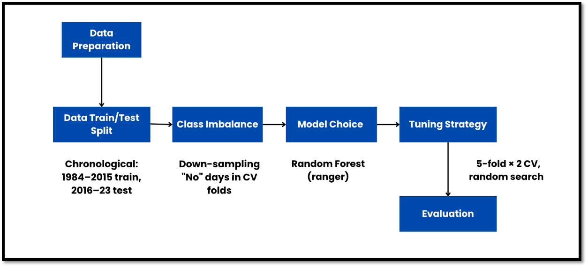
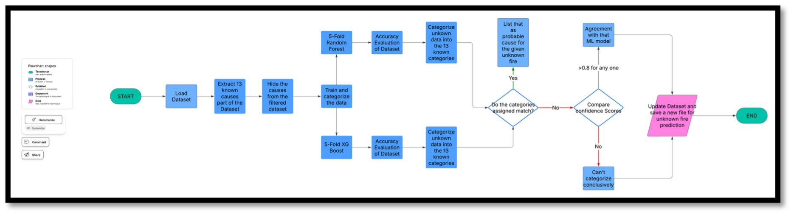

## Motivation

Wildfires in California are a major threat to life, property, and the environment.\
This project aims to identify key environmental factors influencing wildfire duration, classify unknown causes, and detect susceptible zones using machine learning models.

## Dataset Description

We used two primary datasets:\

(1) **CALFIRE wildfire perimeters from 2008 to 2023**, and\

(2) **an engineered dataset from Zenodo.org** with daily fire occurrence and weather data.\

Data engineering steps included calculating fire duration, extracting latitude/longitude from shapes, and integrating temperature and wind data from APIs for modeling.

## Initial Inferences from Dataset

**Field Correlation**\
Correlation between features was generally low—Pearson correlation (Figure 1 below), indicating the need for nonlinear classification methods.

```{r fig1, echo=FALSE, out.width="80%", fig.pos='H', message=FALSE, warning=FALSE, fig.cap="Spearman correlation matrix", fig.align='center'}
# Load libraries
library(dplyr)
library(ggplot2)
library(lubridate)
library(corrplot)

# Load the cleaned dataset
fires <- read.csv("../data/fires_with_max_weather_corrected.csv", stringsAsFactors = FALSE)
fires$ALARM_DATE <- as.Date(fires$ALARM_DATE)

# Select numeric variables for correlation
cor_data <- fires %>%
  select(Shape__Area, FIRE_DURATION, Temperature_C, MaxTemperature_C, WindSpeed_kmh, MaxWindSpeed_kmh) %>%
  na.omit()

# Compute and plot Spearman correlation
corr_matrix <- cor(cor_data, method = "spearman")
corrplot(corr_matrix, method = "color", type = "upper",
         tl.col = "black", addCoef.col = "black",
         title = "Spearman Correlation Matrix",
         mar=c(0,0,1,0))

```

**Seasonal Trends**\
Strong seasonal trend observed in histogram plots. Figure 2 shows significant seasonal fire activity during summer due to high temperatures.

```{r fig2, echo=FALSE, message=FALSE, warning=FALSE, out.width="50%", fig.cap=" Seasonal trends", fig.pos='H', fig.align='center'}
# Load necessary libraries
library(ggplot2)
library(dplyr)
library(lubridate)

# Load the dataset
fires <- read.csv("../data/fires_with_max_weather_corrected.csv", stringsAsFactors = FALSE)

# Convert ALARM_DATE to Date format
fires$ALARM_DATE <- as.Date(fires$ALARM_DATE, format="%Y-%m-%d")

# Plot monthly fire trend
fires %>%
  mutate(month = month(ALARM_DATE, label = TRUE)) %>%
  count(month) %>%
  ggplot(aes(x = month, y = n, fill = month)) +
  geom_bar(stat = "identity") +
  labs(title = "Wildfires Per Month", x = "Month", y = "Number of Fires") +
  theme_minimal() +
  theme(legend.position = "none")
```

**Fire Distribution Trends by Days**\
From the figure-3 below it can be seen that most of the fires are usually contained within the same day which leads to a very large class of fires being 0 days.

```{r fig3, echo=FALSE, message=FALSE, warning=FALSE, out.width="50%", fig.cap=" Fire duration distribution", fig.pos='H', fig.align='center'}

# Load libraries
library(ggplot2)
library(dplyr)
library(lubridate)

# Load data
fires <- read.csv("../data/fires_with_max_weather_corrected.csv", stringsAsFactors = FALSE)
fires$ALARM_DATE <- as.Date(fires$ALARM_DATE, format="%Y-%m-%d")

# Filter out non-finite FIRE_DURATION values
fires_clean <- fires %>%
  filter(is.finite(FIRE_DURATION))

# Plot
ggplot(fires_clean, aes(x = FIRE_DURATION)) +
  geom_histogram(bins = 30, fill = "orange", color = "black") +
  labs(title = "Fire Duration Distribution", x = "Duration (Days)", y = "Count") +
  theme_minimal()
```

**Classification of Fires by Cause**\
Figure-4 below shows that most of the fires that occur are unknown causes of fire around 31%. This is huge chunk of data that needs to be studied to attempt and identify the causes of fire.

```{r fig4, echo=FALSE, message=FALSE, warning=FALSE, out.width="60%", fig.cap=" Classification of Fires by Cause", fig.pos='H', fig.align='center'}

library(ggplot2)
library(dplyr)

# Load and preprocess data
df <- read.csv("../data/fires_with_max_weather_corrected.csv", stringsAsFactors = FALSE)
df <- df[!is.na(df$CAUSE), ]
df$CAUSE <- as.integer(df$CAUSE)

# Define cause labels
cause_labels <- c(
  "1" = "Lightning", "2" = "Equipment Use", "3" = "Smoking", "4" = "Campfire",
  "5" = "Debris", "6" = "Railroad", "7" = "Arson", "8" = "Playing with Fire",
  "9" = "Miscellaneous", "10" = "Vehicle", "11" = "Powerline",
  "12" = "Firefighter Training", "13" = "Non-Firefighter Training",
  "14" = "Unknown", "15" = "Structure", "16" = "Aircraft", "17" = "Volcanic",
  "18" = "Prescribed Burn", "19" = "Illegal Campfire"
)

# Group and summarize cause data
cause_dist <- df %>%
  count(CAUSE) %>%
  mutate(
    Label = cause_labels[as.character(CAUSE)],
    Percent = n / sum(n),
    Group = ifelse(Percent < 0.03, "Other Causes", Label)
  ) %>%
  group_by(Group) %>%
  summarise(Total = sum(n)) %>%
  mutate(
    Fraction = Total / sum(Total),
    ymax = cumsum(Fraction),
    ymin = lag(ymax, default = 0),
    LabelPos = (ymin + ymax) / 2,
    Angle = 360 * LabelPos,
    LabelText = paste0(Group, "\n", Total, " (", round(Fraction * 100, 1), "%)")
  )

# Plot donut chart
ggplot(cause_dist, aes(ymax = ymax, ymin = ymin, xmax = 4, xmin = 2, fill = Group)) +
  geom_rect(color = "white") +
  coord_polar(theta = "y") +
  xlim(c(0, 5.5)) +
  geom_text(
    aes(x = 5.2, y = LabelPos, label = LabelText, angle = 90 - Angle),
    hjust = 0, size = 3.5, color = "black", fontface = "bold"
  ) +
  scale_fill_manual(values = colorRampPalette(c("firebrick", "orange", "forestgreen", "steelblue", "purple"))(nrow(cause_dist))) +
  theme_void() +
  theme(plot.title = element_text(hjust = 0.5, face = "bold")) +
  labs(title = "Distribution of Fire Causes (with Angled Labels)")


```

## Analysis Methodology & Results

### Research Question 1: How effectively can weather variables and seasonal patterns be used to predict wildfire occurrence?

**Problem Statement:**

Many weather metrics can potentially predict wildfires, but this section evaluates how effective they are when used with machine learning models.

**Methodology:**

```{r fig5, echo=FALSE, out.width="80%", fig.cap=" Flowchart", fig.pos='H', fig.align='center'}

```

```{r load_libraries, echo = FALSE, warning = FALSE, message = FALSE, fig.align = "center", fig.pos = 'H', out.width = "80%"}
# 0. Load Required Libraries
# -------------------------------------------------------------------------
# print("Loading libraries...")
library(tidyverse)
library(lubridate)
library(caret)
library(ranger)        # For method = "ranger"
library(pROC)
library(gridExtra)     # For arranging plots
library(randomForest)  # For importance compatibility
# print("Libraries loaded.")
```

```{r echo = FALSE, warning = FALSE, message = FALSE, fig.align = "center", fig.pos = 'H', out.width = "80%"}
# 1. Define Data Loading and Preprocessing Function
# -------------------------------------------------------------------------
load_and_preprocess <- function(data_path) {
  #print(paste("Attempting to load data from:", data_path))
  if (!file.exists(data_path)) { stop("Data file not found: ", data_path) }
  data <- read_csv(data_path, show_col_types = FALSE) # Suppressed col type messages for cleaner output
  
  data <- data %>%
    mutate(
      DATE = as.Date(DATE),
      YEAR = year(DATE),
      MONTH = month(DATE),
      FIRE_START_DAY = as.logical(FIRE_START_DAY)
    ) %>%
    arrange(DATE) %>%
    mutate(
      TEMP_RANGE = MAX_TEMP - MIN_TEMP,
      MONTH_NAME = factor(month(DATE, label = TRUE, abbr = TRUE), levels = month.abb),
      DECADE = factor(floor(YEAR / 10) * 10),
      SEASON = factor(SEASON, levels = c("Spring","Summer","Fall","Winter")),
      LAGGED_PRECIPITATION = lag(PRECIPITATION, n = 1, default = NA),
      LAGGED_AVG_WIND_SPEED = lag(AVG_WIND_SPEED, n = 1, default = NA),
      # Corrected WIND_TEMP_RATIO to avoid division by zero or with NA
      WIND_TEMP_RATIO = ifelse(is.na(MAX_TEMP) | MAX_TEMP == 0, 0, AVG_WIND_SPEED / MAX_TEMP)
    )
  
  #print("Handling missing values with median imputation...")
  num_cols <- data %>% select_if(is.numeric) %>% names()
  for(col in num_cols) {
    if(sum(is.na(data[[col]])) > 0) {
      med <- median(data[[col]], na.rm = TRUE)
      if (is.na(med)) med <- 0 # If all values are NA, median is NA, so impute with 0
      data[[col]][is.na(data[[col]])] <- med
    }
  }
  #print("Missing value imputation complete.")
  return(data)
}
```

```{r define_eval_interpret_functions, echo = FALSE, warning = FALSE, message = FALSE, fig.align = "center", fig.pos = 'H', out.width = "80%"}
# 2. Define Evaluation and Interpretation Functions
# -------------------------------------------------------------------------
plot_importance_caret <- function(model) {
  if (is.null(model)) return(NULL)
  
  model_name <- model$method
  message(paste("Generating Feature Importance Plot for:", model_name))
  
  imp <- varImp(model, scale = FALSE)
  
  # Check for missing or empty importance
  if (is.null(imp) || is.null(imp$importance) || nrow(imp$importance) == 0) {
    warning(paste("No importance data available from varImp for model:", model_name))
    
    gg <- ggplot() +
      labs(title = paste('Top 10 Features -', model_name, '(Importance N/A)')) +
      theme_minimal() +
      theme(plot.title = element_text(hjust = 0.5)) +
      annotate("text", x = 0.5, y = 0.5, label = "Importance data not available.", size = 4)
    
    return(gg)
  }
  
  # Generate importance plot
  gg <- ggplot(imp, top = 10) +
    labs(title = paste('Top 10 Features -', model_name)) +
    theme_minimal(base_size = 10) +
    theme(plot.title = element_text(hjust = 0.5))
  
  return(gg)
}

```

```{r main_script_part1, echo = FALSE, warning = FALSE, message = FALSE, fig.align = "center", fig.pos = 'H', out.width = "80%"}
# =========================================================================
# Main Script Execution
# =========================================================================

# 3. Set Parameters
# -------------------------------------------------------------------------
# IMPORTANT: Ensure 'CA_Weather_Fire_Dataset_1984-2025.csv' is in the data/ folder at the repository root.
data_path       <- "../data/CA_Weather_Fire_Dataset_1984-2025.csv"
split_year      <- 2015
# Corrected variable name from user's script: uetooth_length_rf to tuneLength_rf
tuneLength_rf   <- 3 # Reduced for faster knitting for demonstration; user had 10
cv_repeats      <- 1 # Reduced for faster knitting; user had 2
cv_number       <- 3 # Reduced for faster knitting; user had 5

# 4. Load and Preprocess Data
# -------------------------------------------------------------------------
#print("--- Loading and Preprocessing ---")
data <- load_and_preprocess(data_path)
#print(paste("Dataset dimensions:", paste(dim(data), collapse=" x ")))

# 5. Train/Test Split & Target Preparation
# -------------------------------------------------------------------------
#print("--- Splitting Data & Preparing Target Factor ---")
train_years <- 1984:split_year
latest_year_in_data <- max(data$YEAR, na.rm = TRUE)
end_year_for_test <- min(latest_year_in_data, 2023) # Cap test data
test_years  <- (split_year + 1):end_year_for_test

train_data <- data %>% filter(YEAR %in% train_years)
test_data  <- data %>% filter(YEAR %in% test_years)

# Stop if test_data is empty
if(nrow(test_data) == 0) {
  stop(paste("No data in the test set. 'split_year' is", split_year,
             "and data is available up to year", latest_year_in_data,
             "leading to an empty test range of", (split_year + 1), "to", end_year_for_test, "."))
}

train_data$Fire <- factor(ifelse(train_data$FIRE_START_DAY, "Yes", "No"), levels=c("No","Yes"))
test_data$Fire  <- factor(ifelse(test_data$FIRE_START_DAY, "Yes", "No"), levels=c("No","Yes"))
target <- "Fire"

print(paste("Train dimensions:", paste(dim(train_data), collapse=" x ")))
print(paste("Test dimensions:", paste(dim(test_data), collapse=" x ")))
print("Target variable distribution in training data:")
print(table(train_data[[target]], useNA="ifany"))

features <- c("MAX_TEMP","MIN_TEMP","PRECIPITATION","AVG_WIND_SPEED","TEMP_RANGE",
              "WIND_TEMP_RATIO","LAGGED_PRECIPITATION","LAGGED_AVG_WIND_SPEED","SEASON","MONTH")
features <- intersect(features, names(train_data))
# Filter out any zero-length or NA feature names
features <- features[nzchar(features) & !is.na(features)]

print("Features selected for modeling:")
print(features)

# Check if features list is empty
if(length(features) == 0) {
  stop("No valid features selected for modeling. Check feature names and data columns.")
}

```

```{r main_script_part2_model_training, cache=TRUE, echo = FALSE, warning = FALSE, message = FALSE, fig.align = "center", fig.pos = 'H', out.width = "80%"}
# 6. Cross-Validation Setup (with Down-sampling & Verbose Output)
# -------------------------------------------------------------------------
#print("--- Setting up trainControl ---")
set.seed(123) # for reproducibility
cv_ctrl <- trainControl(
  method            = "repeatedcv",
  number            = cv_number,
  repeats           = cv_repeats,
  summaryFunction   = twoClassSummary,
  classProbs        = TRUE,
  verboseIter       = FALSE, # Set to FALSE for cleaner Rmd output, TRUE for original script behavior
  savePredictions   = "final",
  sampling          = "down",
  allowParallel     = FALSE # Set to TRUE if parallel backend is registered
)
#print("trainControl configured.")

# 7. Random Forest Tuning & Training (using caret)
# -------------------------------------------------------------------------
#print(paste("--- Starting Tuned Ranger Training ---", Sys.time()))
set.seed(456) # for reproducibility
tuned_rf_model <- NULL

# Ensure there's data, features, and multiple classes in the target for training
if(nrow(train_data) > 0 && 
   length(unique(train_data[[target]])) > 1 &&
   length(features) > 0 && 
   ncol(train_data[, features, drop = FALSE]) > 0) {
  
  tuned_rf_model <- train(
    x          = train_data[, features],
    y          = train_data[[target]],
    method     = "ranger",
    metric     = "ROC",
    tuneLength = tuneLength_rf,
    trControl  = cv_ctrl,
    importance = 'permutation'
  )
} else {
  stop("Cannot train model: Issues with training data, target variable, or feature set.")
}
#print(paste("--- Finished Tuned Ranger Training ---", Sys.time()))

if(!is.null(tuned_rf_model)){
    print("Best Ranger hyperparameters found by CV:")
    print(tuned_rf_model$bestTune)
    print("Ranger CV Results (for best tune):")
    # Ensure rownames exist for indexing
    if(rownames(tuned_rf_model$bestTune)[1] %in% rownames(tuned_rf_model$results)){
        print(tuned_rf_model$results[rownames(tuned_rf_model$bestTune),])
    } else {
        print("Could not retrieve specific CV results for the best tune by rownames. Displaying all results:")
        print(tuned_rf_model$results)
    }
} else {
    print("Model was not trained, so no hyperparameters or CV results to display.")
}
```

```{r fig6, echo = FALSE, warning = FALSE, message = FALSE, fig.cap="Figure : ROC Curve on Test Set.",  fig.align = "center", fig.pos = 'H', out.width = "50%"}
# 8. Evaluate on Test Set (using Optimal Thresholds)
# -------------------------------------------------------------------------
rf_probs <- NULL
rf_roc   <- NULL
rf_auc   <- NA
rf_threshold <- 0.5 # Default
rf_cm    <- NULL

if (!is.null(tuned_rf_model) && nrow(test_data) > 0 && length(features) > 0 && ncol(test_data[, features, drop=FALSE]) > 0) {
   # print("--- Evaluating Final Model on Hold-Out Test Set ---")
    rf_probs <- predict(tuned_rf_model, newdata=test_data[,features], type="prob")[,"Yes"]

    if(length(unique(test_data[[target]])) > 1 && length(rf_probs) == nrow(test_data)) {
        rf_roc   <- roc(test_data[[target]], rf_probs, levels=c("No","Yes"), direction="<", quiet=TRUE)
        rf_auc   <- auc(rf_roc)
        coords_roc <- coords(rf_roc, "best", ret="threshold", transpose=FALSE, best.method="youden")
        
        if(nrow(coords_roc) > 0 && "threshold" %in% names(coords_roc)){
          rf_threshold <- coords_roc$threshold[1]
        } else {
         coords_roc_closest <- coords(rf_roc, "closest.topleft", ret="threshold", transpose=FALSE)
         if(nrow(coords_roc_closest) > 0 && "threshold" %in% names(coords_roc_closest)){
            rf_threshold <- coords_roc_closest$threshold[1]
         } # else rf_threshold remains 0.5
        }
        
        rf_pred  <- factor(ifelse(rf_probs >= rf_threshold, "Yes","No"), levels=c("No","Yes"))

        if (all(levels(rf_pred) == levels(test_data[[target]]))) {
            rf_cm  <- confusionMatrix(rf_pred, test_data[[target]], positive="Yes")
            print(paste("Test AUC:", round(rf_auc,4), "| Optimal Threshold:", round(rf_threshold,4)))
            print("Confusion Matrix (Test Set):")
            print(rf_cm$table)
        } else {
            print("Level mismatch for confusion matrix. Cannot compute.")
        }
    } else {
        print("Skipping ROC/CM calculation: Test target has only one class or probability prediction issue.")
    }
} else {
   stop("Cannot evaluate model. Model not trained or test data/features are problematic.")
}

# Plot ROC curve
if(!is.null(rf_roc)){
    plot_obj_roc <- ggplot() +
      geom_line(aes(x=1-rf_roc$specificities, y=rf_roc$sensitivities)) + # Plotting 1-Specificity for standard ROC
      geom_abline(slope=1, intercept=0, linetype="dashed", color="grey") +
      labs(title=paste("ROC Curve on Test Set (AUC = ", round(rf_auc, 3), ")"),
           x="False Positive Rate (1 - Specificity)", y="True Positive Rate (Sensitivity)") +
      theme_minimal(base_size = 10)
    print(plot_obj_roc)
} else {
    plot(NA, xlim=c(0,1), ylim=c(0,1), xlab="1-Specificity", ylab="Sensitivity", main="ROC Curve (Data N/A)")
    text(0.5,0.5, "ROC Data Not Available")
}
```

Higher sensitivity helps identify true fire days.

This RF model generalizes well on unseen data (2016-2023).

**Key Drivers:**

```{r fig7 main_script_part4_importance, echo=FALSE, message=FALSE, warning=FALSE, out.width="60%", fig.cap="Top 10 Feature Importance", fig.pos='H', fig.align='center'}
# 9. Variable Importance
# -------------------------------------------------------------------------
#print("--- Interpreting Model (Variable Importance) ---")
if(!is.null(tuned_rf_model)){
    plot_importance_caret(tuned_rf_model)
} else {
    #plot(NA, xlim=c(0,1), ylim=c(0,1), main="Feature Importance (Model N/A)")
    text(0.5,0.5, "Model not available for importance plot.")
}
```

```{r fig8 main_script_part5_viz1, echo=FALSE, message=FALSE, warning=FALSE, out.width="50%", fig.cap=" Count of Fire Days by Season", fig.pos='H', fig.align='center'}
# 10. Additional Visualizations
# -------------------------------------------------------------------------
#print("--- Additional Visualizations ---")

# Fire Days by Season
if (exists("data") && "FIRE_START_DAY" %in% names(data) && "SEASON" %in% names(data)) {
    plot_obj_season <- ggplot(data %>% filter(FIRE_START_DAY), aes(SEASON)) +
      geom_bar(fill = 'orangered') + # Changed from 'red' for better visibility
      labs(title = 'Count of Fire Days by Season', x = 'Season', y = 'Count of Fire Days') +
      theme_minimal(base_size = 10) +
      theme(plot.title = element_text(hjust = 0.5))
    print(plot_obj_season)
} else {
    plot(NA, xlim=c(0,1), ylim=c(0,1), main="Fire Days by Season (Data N/A)")
    text(0.5,0.5, "Data for plot not available.")
}
```

**Conclusion:**

This shows the efficacy of using ML models on the weather dataset to train and analyze various factors. This also indicates that weather and calender features can effectively predict wildfire ignition.

Month and temperature are better indicators of fire in comparison to other factors.

### Research Question 2: Can We Categorize Unknown Causes of Fires into Known Causes?

**Problem Statement**\
About 31% of fire data cannot be classified due to loss of evidence. We aim to classify unknown fires using ML models.

#### Method 1: Multiclass Classification

Random Forest and XGBoost used. Agreement in classifications marked as true. Else, high-confidence predictions are accepted.

```{r fig9, echo=FALSE, out.width="80%", fig.cap=" Flowchart", fig.pos='H', fig.align='center'}

```

**Results**\
\~51.9% data classified.

```{r fig10, echo=FALSE, message=FALSE, warning=FALSE, out.width="50%", fig.cap=" Method 1 Pie Chart", fig.pos='H', fig.align='center'}

# Load required libraries
library(ggplot2)
library(dplyr)
library(readr)

# Load prediction results
df <- read_csv("../data/cause14_final_ensemble_classification.csv")

# Summarize classification outcomes
df_summary <- df %>%
  mutate(Classification = ifelse(Match == "Yes", "Classified (Match)", "Unmatched (Disagree)")) %>%
  count(Classification) %>%
  mutate(
    perc = n / sum(n) * 100,
    label = paste0(Classification, "\n", n, " (", round(perc, 1), "%)")
  )

# Donut chart
ggplot(df_summary, aes(x = 2, y = n, fill = Classification)) +
  geom_col(width = 1, color = "white") +
  coord_polar(theta = "y") +
  xlim(0.5, 2.5) +
  theme_void() +
  geom_text(aes(label = label), position = position_stack(vjust = 0.5), size = 4) +
  scale_fill_manual(values = c(
    "Classified (Match)" = "#4CAF50",
    "Unmatched (Disagree)" = "#F44336"
  )) +
  ggtitle("Classification Outcome on Cause 14 Fires (Ensemble Models)") +
  theme(
    plot.title = element_text(hjust = 0.5, face = "bold"),
    legend.position = "none"
  )

```

| Metrics | 5-Fold Random Forest | 5-Fold XGBoost |
|------------------------|--------------------------|----------------------|
| Model Accuracy | 39.39% | 41.24% |
| Variable Importance | Maxwindspeed_kmh, Maxtemperatures_C, WindSpeed_kmh, Shape\_\_Area, Temperature_C | Windspeed_kmh, FIRE_DURATION, Temperature_C, Shape\_\_Area, Maxwindspeed_kmh |

**Conclusion**\
Low model accuracy due to class imbalance. Grouping fire causes into binary classes may improve performance.

#### Method 2: Kernelized SVM (RBF)

Human-made vs. Natural fire causes.

```{r fig11, echo=FALSE, message=FALSE, warning=FALSE, out.width="50%", fig.cap=" Natural vs Human Cause Split", fig.pos='H', fig.align='center'}

library(ggplot2)
library(dplyr)
library(scales)

# Load the dataset
df_all <- read.csv("../data/fires_with_max_weather_corrected.csv", stringsAsFactors = FALSE)

# Define grouped causes
human_causes <- c(2:13, 15:16, 18:19)
natural_causes <- c(1, 17)

# Filter and label
df_labeled <- df_all %>%
  filter(CAUSE %in% c(human_causes, natural_causes)) %>%
  mutate(Category = ifelse(CAUSE %in% human_causes, "Human-made", "Natural"))

# Count and calculate percentages
df_pie <- df_labeled %>%
  count(Category) %>%
  mutate(
    Percentage = round(100 * n / sum(n), 1),
    Label = paste0(Category, "\n", n, " (", Percentage, "%)")
  )

# Create pie chart
ggplot(df_pie, aes(x = "", y = n, fill = Category)) +
  geom_bar(stat = "identity", width = 1, color = "white") +
  coord_polar("y") +
  geom_text(
    aes(label = Label),
    position = position_stack(vjust = 0.5),
    color = "white", size = 5
  ) +
  scale_fill_manual(values = c("Human-made" = "darkred", "Natural" = "navyblue")) +
  labs(title = "Fire Cause Breakdown (Labeled Data)", fill = "Cause Type") +
  theme_void() +
  theme(plot.title = element_text(hjust = 0.5, face = "bold"))

```

**Results**\
RBF kernel SVM tested with varying class weights.

```{r fig12, echo=FALSE, message=FALSE, warning=FALSE, out.width="50%", fig.cap=" Weight tuning performance", fig.pos='H', fig.align='center'}

library(e1071)
library(caret)
library(dplyr)
library(ggplot2)

# Load and preprocess data
df <- read.csv("../data/fires_with_max_weather_corrected.csv", stringsAsFactors = FALSE)

# Recode fire cause
human_causes <- c(2:13, 15:16, 18:19)
natural_causes <- c(1, 17)

df <- df %>%
  filter(CAUSE %in% c(human_causes, natural_causes)) %>%
  mutate(CAUSE_BINARY = ifelse(CAUSE %in% human_causes, 1, 0),
         CAUSE_BINARY = as.factor(CAUSE_BINARY)) %>%
  select(CAUSE_BINARY, FIRE_DURATION, Temperature_C, MaxTemperature_C,
         WindSpeed_kmh, MaxWindSpeed_kmh, Shape__Area, ALARM_DATE) %>%
  filter(complete.cases(.))

df$month <- as.numeric(format(as.Date(df$ALARM_DATE), "%m"))

# Features and label
X <- df[, c("FIRE_DURATION", "Temperature_C", "MaxTemperature_C",
            "WindSpeed_kmh", "MaxWindSpeed_kmh", "Shape__Area", "month")]
y <- df$CAUSE_BINARY

# Train with multiple weight ratios
weight_ratios <- c(1, 1.25, 1.5, 1.75, 2)
acc <- numeric(length(weight_ratios))
sens <- numeric(length(weight_ratios))
spec <- numeric(length(weight_ratios))

for (i in seq_along(weight_ratios)) {
  w <- weight_ratios[i]
  model <- svm(x = X, y = y,
               kernel = "radial",
               cost = 1,
               gamma = 0.1,
               class.weights = c("0" = w, "1" = 1),
               scale = TRUE)
  preds <- predict(model, X)
  cm <- confusionMatrix(preds, y)
  acc[i] <- cm$overall["Accuracy"]
  sens[i] <- cm$byClass["Sensitivity"]
  spec[i] <- cm$byClass["Specificity"]
}

# Plot results
df_plot <- data.frame(Weight = weight_ratios, Accuracy = acc, Sensitivity = sens, Specificity = spec)

ggplot(df_plot, aes(x = Weight)) +
  geom_line(aes(y = Accuracy, color = "Accuracy"), size = 1.2) +
  geom_line(aes(y = Sensitivity, color = "Sensitivity"), size = 1.2) +
  geom_line(aes(y = Specificity, color = "Specificity"), size = 1.2) +
  labs(
    title = "Model Performance vs. Class Weight for Natural Fires",
    x = "Weight Ratio (Natural : Human-made)",
    y = "Metric Value",
    color = "Metric"
  ) +
  theme_minimal()
```

**Final Metrics**\
- Accuracy: 84.99%\
- Sensitivity: 61.95%\
- Specificity: 94.20%

```{r fig13, echo=FALSE, message=FALSE, warning=FALSE, out.width="50%", fig.cap=" SVM ROC Curve", fig.pos='H', fig.align='center'}

library(e1071)
library(caret)
library(pROC)
library(dplyr)

# Load and preprocess data
df <- read.csv("../data/fires_with_max_weather_corrected.csv", stringsAsFactors = FALSE)

human_causes <- c(2:13, 15:16, 18:19)
natural_causes <- c(1, 17)

df <- df %>%
  filter(CAUSE %in% c(human_causes, natural_causes)) %>%
  mutate(CAUSE_BINARY = ifelse(CAUSE %in% human_causes, 1, 0),
         CAUSE_BINARY = as.factor(CAUSE_BINARY)) %>%
  select(CAUSE_BINARY, FIRE_DURATION, Temperature_C, MaxTemperature_C,
         WindSpeed_kmh, MaxWindSpeed_kmh, Shape__Area, ALARM_DATE) %>%
  filter(complete.cases(.))

df$month <- as.numeric(format(as.Date(df$ALARM_DATE), "%m"))

# Features and labels
X <- df[, c("FIRE_DURATION", "Temperature_C", "MaxTemperature_C",
            "WindSpeed_kmh", "MaxWindSpeed_kmh", "Shape__Area", "month")]
y <- df$CAUSE_BINARY

# Train final model with probability output
model <- svm(x = X, y = y,
             kernel = "radial",
             cost = 1,
             gamma = 0.1,
             class.weights = c("0" = 1.5, "1" = 1),
             probability = TRUE)

# Predict probabilities
pred <- predict(model, X, probability = TRUE)
prob <- attr(pred, "probabilities")[, "1"]  # probability of Human-made (class "1")

# Plot ROC
roc_obj <- roc(response = y, predictor = prob, levels = rev(levels(y)))
plot(roc_obj, col = "#2C3E50", lwd = 2, main = "ROC Curve for SVM Classifier")
text(0.6, 0.2, paste("AUC =", round(auc(roc_obj), 4)), col = "#2C3E50", cex = 1.2)

```

**Conclusion**\
\~80% confident classification; seasonal trend of predicted causes also follows pattern.

```{r fig14, echo=FALSE, message=FALSE, warning=FALSE, out.width="50%", fig.cap=" SVM classification plot", fig.pos='H', fig.align='center'}

library(ggplot2)
library(dplyr)
library(scales)

# Load prediction output
df14 <- read.csv("../data/cause14_binary_predictions_with_confidence.csv", stringsAsFactors = FALSE)

# Create confidence categories
df14$Confidence_Level <- dplyr::case_when(
  df14$Predicted_Category == "Human-made" & df14$Prob_Human >= 0.8 ~ "Human-made (Confident)",
  df14$Predicted_Category == "Natural" & df14$Prob_Human <= 0.2 ~ "Natural (Confident)",
  TRUE ~ "Needs Review"
)

# Prepare pie chart data
df_conf <- df14 %>%
  count(Confidence_Level) %>%
  mutate(
    Percent = round(100 * n / sum(n), 1),
    Label = paste0(Confidence_Level, "\n", n, " (", Percent, "%)")
  )

# Plot pie chart
ggplot(df_conf, aes(x = "", y = n, fill = Confidence_Level)) +
  geom_bar(stat = "identity", width = 1, color = "white") +
  coord_polar("y") +
  geom_text(aes(label = Label), position = position_stack(vjust = 0.5), color = "white", size = 4.5) +
  scale_fill_manual(values = c(
    "Human-made (Confident)" = "red",
    "Natural (Confident)" = "blue",
    "Needs Review" = "gray"
  )) +
  labs(title = "Cause 14: Confidence Category Breakdown", fill = "Prediction Certainty") +
  theme_void()

```

```{r fig15, echo=FALSE, message=FALSE, warning=FALSE, out.width="50%", fig.cap=" Seasonal Trend Reclassified", fig.pos='H', fig.align='center'}

library(ggplot2)
library(dplyr)

# Load the prediction output
df14 <- read.csv("../data/cause14_binary_predictions_with_confidence.csv", stringsAsFactors = FALSE)

# Extract month from ALARM_DATE
df14$month <- as.numeric(format(as.Date(df14$ALARM_DATE), "%m"))

# Aggregate fire counts by month and predicted category
df_monthly <- df14 %>%
  group_by(month, Predicted_Category) %>%
  summarise(FireCount = n(), .groups = "drop")

# Plot monthly variation histogram
ggplot(df_monthly, aes(x = factor(month), y = FireCount, fill = Predicted_Category)) +
  geom_bar(stat = "identity", position = "dodge") +
  geom_text(aes(label = FireCount), position = position_dodge(width = 0.9), vjust = -0.5, size = 3.5) +
  scale_fill_manual(values = c("Human-made" = "red", "Natural" = "blue")) +
  labs(title = "Predicted Cause 14 Fires by Month",
       x = "Month", y = "Number of Fires", fill = "Predicted Category") +
  theme_minimal()

```

```{r fig16, echo=FALSE, message=FALSE, warning=FALSE, out.width="50%", fig.cap=" Example SVM grouping", fig.pos='H', fig.align='center'}

library(e1071)
library(ggplot2)
library(dplyr)

# Load and preprocess data
df <- read.csv("../data/fires_with_max_weather_corrected.csv", stringsAsFactors = FALSE)

human_causes <- c(2:13, 15:16, 18:19)
natural_causes <- c(1, 17)

df <- df %>%
  filter(CAUSE %in% c(human_causes, natural_causes)) %>%
  mutate(CAUSE_BINARY = factor(ifelse(CAUSE %in% human_causes, 1, 0)))

# Use only FIRE_DURATION and MaxTemperature_C
df_subset <- df %>%
  select(FIRE_DURATION, MaxTemperature_C, CAUSE_BINARY) %>%
  filter(complete.cases(.))

# Scale the features
X_scaled <- scale(df_subset[, c("FIRE_DURATION", "MaxTemperature_C")])
df_scaled <- as.data.frame(X_scaled)
df_scaled$CAUSE_BINARY <- df_subset$CAUSE_BINARY

# Train SVM model with 1.5:1 class weight
svm_model <- svm(CAUSE_BINARY ~ ., data = df_scaled,
                 kernel = "radial", cost = 1, gamma = 0.1,
                 class.weights = c("0" = 1.5, "1" = 1),
                 probability = TRUE)

# Predict on training data for plotting
df_scaled$Prediction <- predict(svm_model, newdata = df_scaled)

# Generate decision boundary grid
x_range <- seq(min(df_scaled$MaxTemperature_C), max(df_scaled$MaxTemperature_C), length.out = 400)
y_range <- seq(min(df_scaled$FIRE_DURATION), max(df_scaled$FIRE_DURATION), length.out = 400)
grid <- expand.grid(MaxTemperature_C = x_range, FIRE_DURATION = y_range)
grid$Prediction <- predict(svm_model, newdata = grid)

# Plot with shaded regions and predicted points
ggplot() +
  geom_tile(data = grid, aes(x = MaxTemperature_C, y = FIRE_DURATION, fill = Prediction), alpha = 0.25) +
  geom_point(data = df_scaled, aes(x = MaxTemperature_C, y = FIRE_DURATION, color = Prediction), size = 1.5) +
  scale_color_manual(values = c("0" = "blue", "1" = "red"), labels = c("Natural", "Human-made"), name = "Prediction") +
  scale_fill_manual(values = c("0" = "lightblue", "1" = "lightpink"), labels = c("Natural", "Human-made"), name = "Predicted Region") +
  labs(title = "SVM Decision Boundary: Fire Duration vs Max Temperature",
       x = "Max Temperature (scaled)",
       y = "Fire Duration (scaled)") +
  theme_minimal(base_size = 13)


```

### Research Question 3: How Does Daily Weather Affect Wildfire Duration?

**Problem Statement:**

How do daily weather variables influence wildfire duration? We classify fire into two categories - short and long- based on most optimally accurate result.

#### Methodology:

A 5-fold SVD with RBF kernel was used to train and test classification across fire durations, with 5 days identified as the optimal threshold for short vs long fires.

#### Results:

**Testing for optimal number of days:**

Threshold sensitivity analysis (2-20 days) shows 5, 6, 7 days as good balance points. This is indicated by the higher kappa values achieved on these three days.

```{r fig17, echo=FALSE, message=FALSE, warning=FALSE, fig.align='center', out.width='80%', fig.cap="SVM Classification metrics vs fire duration threshold"}
# Load required packages
library(dplyr)
library(readr)
library(e1071)
library(caret)
library(ggplot2)
library(tidyr)

# Read the data (assumes the CSV lives alongside this .Rmd)
df <- read_csv("../data/CA_Weather_Fire_Dataset_2008_2023_with_duration.csv")

# Keep only days with a fire
fire_days <- df %>% filter(FIRE_DURATION > 0)

# Prepare a place to collect metrics
thresholds    <- 2:20
metrics_list  <- vector("list", length(thresholds))

# Loop over thresholds
for (i in seq_along(thresholds)) {
  t        <- thresholds[i]
  fire_df  <- fire_days %>%
    mutate(FIRE_CLASS = ifelse(FIRE_DURATION <= t, "Short", "Long")) %>%
    select(MAX_TEMP, MIN_TEMP, TEMP_RANGE,
           AVG_WIND_SPEED, WIND_TEMP_RATIO,
           PRECIPITATION, LAGGED_PRECIPITATION,
           DAY_OF_YEAR, MONTH, FIRE_CLASS) %>%
    na.omit()
  
  # train/test split
  set.seed(123)
  idx   <- createDataPartition(fire_df$FIRE_CLASS, p = 0.8, list = FALSE)
  train <- fire_df[idx, ]
  test  <- fire_df[-idx, ]
  
  # scale
  pp    <- preProcess(train[ , -ncol(train)], method = c("center","scale"))
  tr    <- predict(pp, train[ , -ncol(train)])
  te    <- predict(pp, test[ , -ncol(test)])
  tr$FIRE_CLASS <- factor(train$FIRE_CLASS)
  te$FIRE_CLASS <- factor(test$FIRE_CLASS)
  
  # fit SVM
  model <- svm(FIRE_CLASS ~ ., data = tr, kernel = "radial")
  pred  <- predict(model, newdata = te)
  cm    <- confusionMatrix(pred, te$FIRE_CLASS, positive = "Long")
  
  # store
  metrics_list[[i]] <- data.frame(
    Threshold        = t,
    Accuracy         = cm$overall["Accuracy"],
    Kappa            = cm$overall["Kappa"],
    Sensitivity      = cm$byClass["Sensitivity"],
    Specificity      = cm$byClass["Specificity"],
    BalancedAccuracy = cm$byClass["Balanced Accuracy"]
  )
}

# combine & reshape
metrics_df   <- bind_rows(metrics_list)
metrics_long <- pivot_longer(metrics_df, -Threshold,
                             names_to = "Metric", values_to = "Value")

# plot
ggplot(metrics_long, aes(x = Threshold, y = Value, color = Metric)) +
  geom_line(size = 1.2) +
  geom_point(size = 2) +
  theme_minimal() +
  labs(
    title = "SVM Classification Metrics vs Fire Duration Threshold",
    x     = "Fire Duration Threshold (days)",
    y     = "Metric Value",
    color = "Metric"
  ) +
  geom_vline(
    xintercept = metrics_df$Threshold[which.max(metrics_df$Accuracy)],
    linetype = "dashed"
  ) +
  annotate(
    "text",
    x     = metrics_df$Threshold[which.max(metrics_df$Accuracy)],
    y     = max(metrics_df$Accuracy, na.rm = TRUE),
    label = "Peak Accuracy",
    vjust = -1,
    hjust = 1.1
  )


```

Below figure compares the confusion matrices to help determine final class.

```{r fig18, echo=FALSE, message=FALSE, warning=FALSE, fig.cap="Confusion Matrices for Thresholds 5, 6, and 7", fig.align='left', fig.pos= 'H', fig.width=7, fig.height=5}
# Load libraries
library(dplyr)
library(readr)
library(e1071)
library(caret)
library(ggplot2)
library(gridExtra)

# Load dataset
df <- read_csv("../data/CA_Weather_Fire_Dataset_2008_2023_with_duration.csv")

# Filter only fire days
fire_days <- df %>% filter(FIRE_DURATION > 0)

# Define thresholds and prepare plot list
thresholds <- c(5, 6, 7)
conf_plots <- list()

# Loop over each threshold
for (t in thresholds) {
  fire_data <- fire_days %>%
    mutate(FIRE_CLASS = ifelse(FIRE_DURATION <= t, "Short", "Long")) %>%
    select(MAX_TEMP, MIN_TEMP, TEMP_RANGE, AVG_WIND_SPEED, 
           WIND_TEMP_RATIO, PRECIPITATION, LAGGED_PRECIPITATION, 
           DAY_OF_YEAR, MONTH, FIRE_CLASS) %>%
    na.omit()
  
  set.seed(123)
  index <- createDataPartition(fire_data$FIRE_CLASS, p = 0.8, list = FALSE)
  train <- fire_data[index, ]
  test <- fire_data[-index, ]
  
  preproc <- preProcess(train[, -ncol(train)], method = c("center", "scale"))
  train_scaled <- predict(preproc, train[, -ncol(train)])
  test_scaled <- predict(preproc, test[, -ncol(test)])
  
  train_scaled$FIRE_CLASS <- as.factor(train$FIRE_CLASS)
  test_scaled$FIRE_CLASS <- as.factor(test$FIRE_CLASS)
  
  model <- svm(FIRE_CLASS ~ ., data = train_scaled, kernel = "radial")
  pred <- predict(model, newdata = test_scaled)
  cm <- confusionMatrix(pred, test_scaled$FIRE_CLASS, positive = "Long")
  
  cm_table <- as.data.frame(cm$table)
  
  p <- ggplot(cm_table, aes(x = Prediction, y = Reference, fill = Freq)) +
    geom_tile(color = "white") +
    geom_text(aes(label = Freq), fontface = "bold", size = 4) +
    scale_fill_gradient(low = "white", high = "steelblue") +
    labs(
      title = paste("Threshold =", t),
      subtitle = paste("Accuracy =", round(cm$overall["Accuracy"], 3),
                       "| Kappa =", round(cm$overall["Kappa"], 3)),
      x = "Predicted", y = "Actual", fill = "Freq"
    ) +
    theme_minimal(base_size = 12) +
    theme(plot.title = element_text(face = "bold"),
          plot.subtitle = element_text(size = 10),
          legend.position = "right")
  
  conf_plots[[length(conf_plots) + 1]] <- p
}

# Display all three plots side-by-side
grid.arrange(grobs = conf_plots, ncol = 3)

```

**Metrics for n = 5 days.**

```{r svm-analysis, echo=FALSE, message=FALSE, warning=FALSE, fig.cap=NULL}
# Load libraries
library(dplyr)
library(readr)
library(e1071)
library(caret)

# 1) Read & prepare data (adjust filename as needed)
df <- read_csv("../data/CA_Weather_Fire_Dataset_2008_2023_with_duration.csv")

# 2) Filter and define classes
fire_days <- df %>%
  filter(FIRE_DURATION > 0) %>%
  mutate(FIRE_CLASS = ifelse(FIRE_DURATION <= 5, "Short", "Long"))

# 3) Select predictors + target, drop NAs
svm_data <- fire_days %>%
  select(
    MAX_TEMP, MIN_TEMP, TEMP_RANGE,
    AVG_WIND_SPEED, WIND_TEMP_RATIO,
    PRECIPITATION, LAGGED_PRECIPITATION,
    DAY_OF_YEAR, MONTH, FIRE_CLASS
  ) %>%
  na.omit()

# 4) Split into train/test
set.seed(123)
train_idx   <- createDataPartition(svm_data$FIRE_CLASS, p = 0.8, list = FALSE)
train_data  <- svm_data[train_idx, ]
test_data   <- svm_data[-train_idx, ]

# 5) Center & scale
preproc      <- preProcess(train_data[ , -ncol(train_data)], method = c("center","scale"))
train_scaled <- predict(preproc, train_data[ , -ncol(train_data)])
test_scaled  <- predict(preproc, test_data[ , -ncol(test_data)])
train_scaled$FIRE_CLASS <- factor(train_data$FIRE_CLASS)
test_scaled$FIRE_CLASS  <- factor(test_data$FIRE_CLASS)

# 6) Train SVM & predict
svm_model   <- svm(FIRE_CLASS ~ ., data = train_scaled, kernel = "radial", probability = TRUE)
predictions <- predict(svm_model, newdata = test_scaled)

# 7) Confusion matrix & accuracy
cm <- confusionMatrix(predictions, test_scaled$FIRE_CLASS)

# 8) Print results
print(cm)
#cat("\nOverall Accuracy:", sprintf("%.2f%%", cm$overall["Accuracy"]*100), "\n")

```

-   Overall Accuracy: 79.18%
-   Kappa value: 0.5862

### Conclusions:

**SVM plots for boundary separation:**

```{r define-svm-boundary-function, echo=FALSE, message=FALSE, warning=FALSE}
plot_svm_boundary <- function(x_feature, y_feature, data) {
  library(dplyr)
  library(ggplot2)
  library(e1071)
  library(caret)

  # Step 1: Prepare data
  svm_data <- data %>%
    select(all_of(c(x_feature, y_feature)), FIRE_CLASS) %>%
    na.omit()

  # Ensure FIRE_CLASS is a factor
  svm_data$FIRE_CLASS <- as.factor(svm_data$FIRE_CLASS)

  # Step 2: Train-test split
  set.seed(123)
  train_index <- createDataPartition(svm_data$FIRE_CLASS, p = 0.8, list = FALSE)
  train_data <- svm_data[train_index, ]
  test_data  <- svm_data[-train_index, ]

  # Step 3: Scaling
  preproc <- preProcess(train_data[, -3], method = c("center", "scale"))
  train_scaled <- predict(preproc, train_data[, -3])
  test_scaled  <- predict(preproc, test_data[, -3])
  
  train_scaled$FIRE_CLASS <- train_data$FIRE_CLASS
  test_scaled$FIRE_CLASS  <- test_data$FIRE_CLASS

  # Step 4: Train SVM (Classification)
  svm_model <- svm(FIRE_CLASS ~ ., data = train_scaled,
                   kernel = "radial",
                   probability = TRUE)

  # Step 5: Generate grid
  x_range <- seq(min(train_scaled[[x_feature]]) - 0.5, max(train_scaled[[x_feature]]) + 0.5, length.out = 200)
  y_range <- seq(min(train_scaled[[y_feature]]) - 0.5, max(train_scaled[[y_feature]]) + 0.5, length.out = 200)
  grid <- expand.grid(x_range, y_range)
  names(grid) <- c(x_feature, y_feature)

  # Predict on grid and test
  grid$Prediction <- predict(svm_model, newdata = grid)
  test_pred <- predict(svm_model, newdata = test_scaled)

  # Step 6: Plot
  p <- ggplot() +
    geom_tile(data = grid, aes_string(x = x_feature, y = y_feature, fill = "Prediction"), alpha = 0.3) +
    geom_point(data = test_scaled, aes_string(x = x_feature, y = y_feature, color = "test_pred"), size = 2) +
    geom_contour(data = cbind(grid, class = as.numeric(grid$Prediction == "Long")),
                 aes_string(x = x_feature, y = y_feature, z = "class"),
                 breaks = 0.5, color = "black", size = 1) +
    scale_fill_manual(values = c("Short" = "lightblue", "Long" = "pink")) +
    scale_color_manual(values = c("Short" = "blue", "Long" = "red")) +
    labs(
      title = paste("SVM Boundary:", x_feature, "vs", y_feature),
      x = paste(x_feature, "(scaled)"),
      y = paste(y_feature, "(scaled)"),
      fill = "Predicted Region",
      color = "Predicted Fire Class"
    ) +
    theme_minimal()

  return(p)
}


```

```{r fig19, echo=FALSE, message=FALSE, warning=FALSE, fig.align='center', out.width='60%',fig.pos='H', fig.cap="SVM Boundary: MIN TEMP vs AVG WIND SPEED"}
plot_svm_boundary("MIN_TEMP", "AVG_WIND_SPEED", fire_days)
```

```{r fig20, echo=FALSE, message=FALSE, warning=FALSE, fig.align='center', out.width='60%',fig.pos='H', fig.cap="SVM Boundary: DAY OF YEAR vs MIN TEMP"}
plot_svm_boundary("DAY_OF_YEAR", "MIN_TEMP", fire_days)
```

-   From fig19- longer fires usually have higher minimum temperature.

-   From fig20- Longer fires are usually observed during middle of the year (May till July) and is usually distributed across higher maximum temperature.

    There are many such conclusions which can be derived from the trained model.

Linear models miss key weather patterns, while RBF-SVM effectively captures correlations for long-burn events, enabling resource prediction based solely on weather and temporal data.

```{r setup, include=FALSE}
# Global options for R chunks
knitr::opts_chunk$set(
  echo = FALSE, # Show R code in the document
  warning = FALSE,
  message = FALSE,
  fig.align = "center",
  fig.pos = 'H', # Attempt to place figures "here"
  out.width = "80%"
)

# Load general purpose libraries that might be used implicitly by other packages
# or for any minor Rmd-specific manipulations if needed later.
# The main script loads its own libraries.
library(knitr) # For kable, if used for tables (not in current script directly)
```

## Research Question 4: Wildfire Hotspot & Risk Zone Identification

**Problem Statement:**\
Wildfires tend to cluster due to environmental factors; this analysis uses DBSCAN to identify geographic hotspots and risk zones for targeted prevention.

**Methodology:**\
DBSCAN was applied to fire location data to identify dense wildfire regions. A composite risk score using temperature, duration, and wind speed categorized events into risk levels, visualized on a California map.

```{r rq3-load-packages, message=FALSE, warning=FALSE}
# Uncomment to install if needed
# install.packages(c("ggplot2","dbscan","maps","dplyr","tidyr"))

library(ggplot2)    # Plotting
library(dbscan)     # DBSCAN clustering
library(maps)       # US map outlines
library(dplyr)      # Data manipulation
library(tidyr)      # Data reshaping
```

```{r fig21, echo=FALSE, message=FALSE, warning=FALSE, fig.align='center', fig.pos='H', out.width='50%', fig.cap="Wildfire Density Heatmap with Regional Labels"}

dataset <- read.csv("../data/fires_with_max_weather_corrected.csv")
# Define major California regions
regions <- data.frame(
  name = c("Northern California","Sacramento","San Francisco",
           "Central Valley","Fresno","Southern California",
           "Los Angeles","San Diego","Sierra Nevada","Lake Tahoe"),
  lon  = c(-122, -121.49, -122.42,
           -120, -119.77, -117.5,
           -118.25, -117.16, -119.5, -120),
  lat  = c(41.5, 38.58, 37.77,
           36.5, 36.74, 34,
           34.05, 32.72, 38.5, 39)
)

# Plot 2D density heatmap
ggplot(dataset, aes(x = Longitude, y = Latitude)) +
  borders("state", regions = "california", fill = "gray95", color = "gray80") +
  stat_density2d(aes(fill = after_stat(level)), geom = "polygon", alpha = 0.5) +
  geom_text(data = regions, aes(x = lon, y = lat, label = name),
            color = "black", fontface = "bold", size = 3.5, check_overlap = TRUE) +
  scale_fill_gradientn(colors = c("yellow","red")) +
  labs(title = "Wildfire Density Heatmap with Regional Labels",
       x = "Longitude", y = "Latitude", fill = "Density Level") +
  theme_minimal()
```

Southern California, Central Valley, and Sierra Nevada show higher fire clustering. DBSCAN was refined post-presentation for more robust verification.

```{r fig22, echo=FALSE, message=FALSE, warning=FALSE, fig.align='center', fig.pos='H', out.width='50%', fig.cap="DBSCAN Clustering of Wildfire Locations"}

# Perform DBSCAN clustering on fire coordinates
coords <- dataset[, c("Longitude","Latitude")]
db <- dbscan(coords, eps = 0.15, minPts = 15)
dataset$cluster <- factor(db$cluster, levels = sort(unique(db$cluster)))

# Plot DBSCAN clusters on California map
ggplot(dataset, aes(x = Longitude, y = Latitude, color = cluster)) +
  borders("state", regions = "california", fill = "gray95", color = "gray80") +
  geom_point(size = 1.2, alpha = 0.8) +
  geom_text(data = regions, aes(x = lon, y = lat, label = name),
            color = "black", fontface = "bold", size = 3.2, check_overlap = TRUE) +
  scale_color_brewer(palette = "Dark2") +
  labs(title = "DBSCAN Clustering of Wildfire Locations", x = "Longitude", y = "Latitude") +
  theme_minimal()
```

Next to evaluate fire behavior k-means clustering with k=4 was performed.

```{r fire-behavior-kmeans, echo=FALSE, message=FALSE, warning=FALSE}
# Cluster fires based on behavior: duration, max temperature, wind speed

behavior_data <- dataset %>%
  select(FIRE_DURATION, MaxTemperature_C, MaxWindSpeed_kmh) %>%
  na.omit()

# Standardize for k-means
behavior_scaled <- scale(behavior_data)

# Run K-means with 4 clusters
set.seed(123)
kmodel <- kmeans(behavior_scaled, centers = 4)

# Add cluster labels back to original dataset
dataset_behavior <- dataset %>%
  filter(!is.na(FIRE_DURATION), !is.na(MaxTemperature_C), !is.na(MaxWindSpeed_kmh)) %>%
  mutate(fire_behavior_cluster = factor(kmodel$cluster))
```

```{r fig23, echo=FALSE, message=FALSE, warning=FALSE, fig.align='center', fig.pos='H', out.width='50%', fig.cap="Fire Behavior Clustering: Duration vs Temperature"}
# Plot fire clusters based on duration and max temperature

ggplot(dataset_behavior, aes(x = MaxTemperature_C, y = FIRE_DURATION,
                             color = fire_behavior_cluster)) +
  geom_point(alpha = 0.6) +
  labs(title = "Fire Behavior Clustering: Duration vs Temperature",
       x = "Max Temperature (°C)", y = "Fire Duration (Days)",
       color = "Behavior Cluster") +
  theme_minimal()
```

Above figure suggests, cluster-1 has higher fire duration and it leans towards average max temperatures of 30 deg-cel, which correlates with results seen in RQ3.

Further, weather statistics were evaluated for these 4 clusters.

```{r fig24, echo=FALSE, message=FALSE, warning=FALSE, fig.align='center', fig.pos='H', out.width='50%', fig.cap="Fire Behavior Averages per Cluster"}
# Calculate and plot average fire behavior metrics by cluster

behavior_summary <- dataset_behavior %>%
  group_by(fire_behavior_cluster) %>%
  summarise(
    avg_duration = mean(FIRE_DURATION),
    avg_temp     = mean(MaxTemperature_C),
    avg_wind     = mean(MaxWindSpeed_kmh),
    .groups      = "drop"
  )

# Convert to long format for plotting
behavior_long <- behavior_summary %>%
  pivot_longer(cols = starts_with("avg_"),
               names_to   = "metric",
               values_to  = "value")

# Bar plot of averages
ggplot(behavior_long, aes(x = fire_behavior_cluster, y = value, fill = metric)) +
  geom_bar(stat = "identity", position = "dodge") +
  scale_fill_brewer(palette = "Set2") +
  labs(title = "Fire Behavior Averages per Cluster",
       x = "Behavior Cluster", y = "Average Value", fill = "Metric") +
  theme_minimal()
```

From above chart it can be seen that higher fire durations usually have higher temperatures but lower windspeeds, which shows windspeed may not have any significant impact on fire duration.

**Fire Risk Map:**

One of the most important outcomes from this research question is identifying the risk zones which are indicated in the map below.

```{r fig25, echo=FALSE, message=FALSE, warning=FALSE, fig.align='center', fig.pos='H', out.width='60%', fig.cap="Fire Risk Levels by Geographic Cluster (DBSCAN)"}
# Compute risk score for each DBSCAN cluster
cluster_risk <- aggregate(cbind(FIRE_DURATION, MaxTemperature_C, MaxWindSpeed_kmh) ~ cluster,
                          data = dataset, FUN = mean)

# Standardize severity metrics
cluster_risk[,2:4] <- scale(cluster_risk[,2:4])
cluster_risk$risk_score <- rowMeans(cluster_risk[,2:4])

# Merge scores back to main dataset
dataset_risk <- merge(dataset, cluster_risk[, c("cluster","risk_score")],
                      by = "cluster", all.x = TRUE)

# Classify into risk levels
dataset_risk$risk_level <- cut(dataset_risk$risk_score,
                               breaks = c(-Inf, -0.5, 0, 0.5, Inf),
                               labels = c("Low", "Moderate", "High", "Very High"))

# Plot geographic risk zones
ggplot(dataset_risk, aes(x = Longitude, y = Latitude, color = risk_level)) +
  borders("state", regions = "california", fill = "gray95", color = "gray80") +
  geom_point(size = 1.2, alpha = 0.7) +
  geom_text(data = regions, aes(x = lon, y = lat, label = name),
            color = "black", fontface = "bold", size = 3.2, check_overlap = TRUE) +
  scale_color_manual(values = c("Low"="green", "Moderate"="yellow",
                                "High"="orange", "Very High"="red")) +
  labs(title = "Fire Risk Levels by Geographic Cluster",
       x = "Longitude", y = "Latitude", color = "Risk Level") +
  theme_minimal()

```

[High risk zones:]{.underline} Southern California, Central Valley, Sacramento.

## Improvements

As suggested by instructor reviews and peer feedbacks following improvements were made after final presentation:

-   Clear and cohesive arrangement for the flow of research questions.

-   Results of using HDBSCAN for RQ4 is shown below:

    HDBSCAN results in a better clustering but required a lot of tuning and muting noisy values. Below figures indicate the same.

    ```{r fig26, echo=FALSE, message=FALSE, warning=FALSE, fig.align='center', fig.pos='H', out.width='60%', fig.cap="Fire Risk Levels by Geographic Cluster (HDBSCAN)"}
    # --- Load Required Packages ---
    library(ggplot2)
    library(maps)
    library(dbscan)

    # --- Load Dataset ---
    dataset <- read.csv("../data/fires_with_max_weather_corrected.csv")

    # --- Run HDBSCAN on Scaled Coordinates ---
    coords <- dataset[, c("Longitude", "Latitude")]
    coords_scaled <- scale(coords)
    hdb <- hdbscan(coords_scaled, minPts = 150)
    dataset$cluster_hdb <- factor(hdb$cluster)

    # --- Region Labels for Reference ---
    regions <- data.frame(
      name = c("Northern California", "Sacramento", "San Francisco",
               "Central Valley", "Fresno", "Southern California",
               "Los Angeles", "San Diego", "Sierra Nevada", "Lake Tahoe"),
      lon  = c(-122, -121.49, -122.42, -120, -119.77, -117.5,
               -118.25, -117.16, -119.5, -120),
      lat  = c(41.5, 38.58, 37.77, 36.5, 36.74, 34,
               34.05, 32.72, 38.5, 39)
    )

    # 1. Filter out noise (cluster_hdb == 0) for risk scoring
    dataset_filtered <- dataset %>%
      filter(cluster_hdb != 0)

    # 2. Compute per-cluster severity metrics
    cluster_metrics <- dataset_filtered %>%
      group_by(cluster_hdb) %>%
      summarise(
        mean_duration = mean(FIRE_DURATION, na.rm = TRUE),
        mean_temp     = mean(MaxTemperature_C, na.rm = TRUE),
        mean_wind     = mean(MaxWindSpeed_kmh, na.rm = TRUE),
        .groups = "drop"
      )

    # 3. Normalize and compute composite risk score
    cluster_scaled <- cluster_metrics %>%
      mutate(across(starts_with("mean_"), scale)) %>%
      mutate(risk_score = rowMeans(across(starts_with("mean_"))))

    # 4. Merge scores into full dataset (including noise for plotting)
    dataset_risk <- dataset %>%
      left_join(cluster_scaled %>% select(cluster_hdb, risk_score), by = "cluster_hdb")

    # 5. Assign risk level only to non-noise points
    dataset_risk$risk_level <- cut(dataset_risk$risk_score,
                                   breaks = c(-Inf, -0.5, 0, 0.5, Inf),
                                   labels = c("Low", "Moderate", "High", "Very High"),
                                   ordered_result = TRUE)

    # 6. Plot: colored by risk level, noise shown in gray
    ggplot() +
      borders("state", regions = "california", fill = "gray95", color = "gray80") +
      geom_point(data = subset(dataset_risk, cluster_hdb == 0),
                 aes(x = Longitude, y = Latitude),
                 color = "gray70", alpha = 0.3, size = 1) +
      geom_point(data = subset(dataset_risk, cluster_hdb != 0),
                 aes(x = Longitude, y = Latitude, color = risk_level),
                 alpha = 0.8, size = 1.2) +
      geom_text(data = regions,
                aes(x = lon, y = lat, label = name),
                color = "black", fontface = "bold", size = 3.2,
                check_overlap = TRUE) +
      scale_color_manual(values = c("Low" = "green", "Moderate" = "yellow",
                                    "High" = "orange", "Very High" = "red"),
                         na.value = "gray") +
      labs(title = "Fire Risk Levels by Geographic Cluster (Excluding Noise)",
           x = "Longitude", y = "Latitude", color = "Risk Level") +
      theme_minimal()


    ```

Above figure clearly shows, the risk zone mapping using HDBSCAN provides cleaner clusters.

[Final High risk zones:]{.underline} Southern California (LA, Ventura) and Central Valley (Sacramento).

## Future Work

-   Exploring creation of web based dashboard for prediction of probable fire regions based on all the models trained above, by integrating live weather data to predict the zones of highest probable fire.

-   Integrate projected monetary loss calculation based on the average property rates by area.

## Contribution Statement

All team member contributed equally in exploratory analysis, data engineering, analysis and reporting. Weekly meetings were conducted to review progress.

## References & Acknowledgements

1.  [CALFIRE Fire Perimeters](https://www.fire.ca.gov/what-we-do/fire-resource-assessment-program/fire-perimeters)
2.  [Zenodo Dataset](https://zenodo.org/records/14712845)
3.  <https://www.ncei.noaa.gov/access/monitoring/monthly-report/fire>
4.  <https://oehha.ca.gov/sites/default/files/media/downloads/climate-change/document/04wildfires.pdf>

We would like to thank Prof. Wang and Prof. Yu for teaching and guiding us through various concepts of statistical Data Science. We are very thankful for the timely feedback on the project which improved the quality of final implementation. We also extend our thanks to our classmates who supported us by providing critical and important feedback.

## Addendum

Below are a few ChatGPT prompts that were used to optimize codes and generate results:

1.  Why is the correlation between variables so low?
2.  Why is this error occurring? Can we train the data from scratch instead of using filtered data?
3.  How do I use this model to classify new data without re-training it every time?
4.  Give me code to overlay decision boundaries and actual predictions in one plot.
5.  What is the best way to tune class weights to optimize sensitivity?
6.  Give me a standardized script to evaluate both manual and automated weight tuning using the same test split or folds.
7.  How do I plot the ROC AUC curve for SVM?
8.  How do I use this model to map all cause-14 based on the ML model we have?
9.  I need to write a .Rmd file for the final report. How am I supposed to do that?
